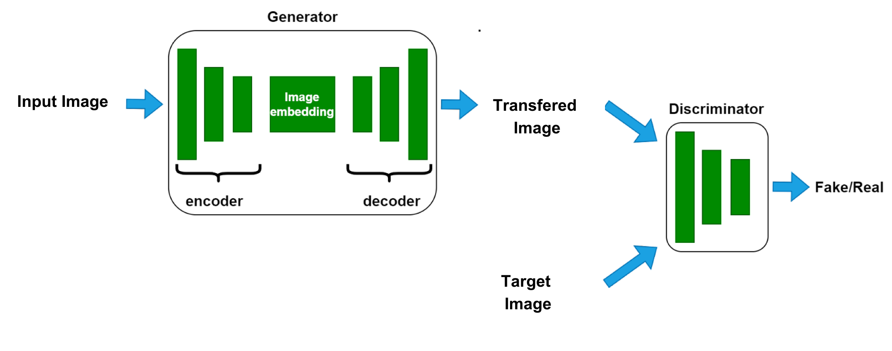

# Satellite2Map
 Transforming Satellite images to Map  using Pix2Pix GAN

# Project Overview

The Satellite-to-Map GAN project showcases the power of deep learning in transforming satellite images into realistic map-like representations. This repository contains an implementation of a Pix2Pix GAN using the PyTorch framework. The primary objective of this project is to demonstrate how GANs can be used to generate high-quality images.

Pix2Pix is a GAN architecture that's designed for image-to-image translation tasks. It was introduced by researchers at the University of California, Berkeley, in their 2016 paper titled "Image-to-Image Translation with Conditional Adversarial Networks."

https://arxiv.org/abs/1611.07004

GANs consist of two main components: a generator and a discriminator. These components engage in an adversarial process, leading to the generation of novel data that closely resembles the training data.

The generator creates new data instances by learning from a dataset. In this project, the generator learns to convert satellite images into map-like images. It starts by producing images that might not be very realistic but gradually improves its output through training.

The discriminator acts as a critic, distinguishing between real data and data generated by the generator. It provides feedback to the generator, guiding it to produce more convincing images. Over time, this adversarial interaction drives the generator to produce images that are increasingly indistinguishable from real map images.

# Training 

During training, the generator and discriminator compete in a series of iterations. The generator aims to create images that deceive the discriminator, while the discriminator aims to correctly classify real and generated images. This competition leads to the refinement of the generator's ability to produce convincing map-like images.

